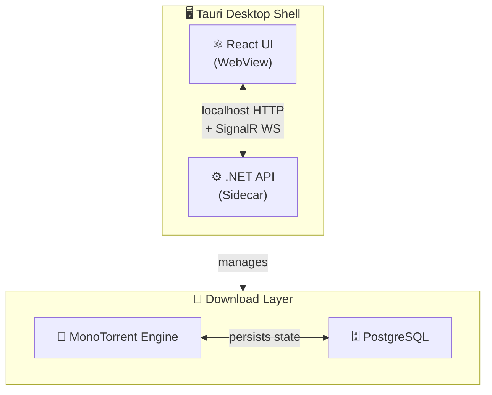

# HarborTorrent

A cross-platform desktop torrent management client for **Windows** and **Linux**, built with a modern React frontend and a self-hosted .NET 10 download engine.

HarborTorrent bundles the backend as a Tauri sidecar binary, so it ships as a single native desktop application — no separate server setup required.

---

## Tech Stack

| Layer | Technology |
|---|---|
| Desktop Shell | [Tauri v2](https://tauri.app) |
| UI Framework | React 18 + TypeScript + Vite |
| Styling | TailwindCSS v4 |
| Server State | TanStack Query v5 |
| Real-time Updates | Microsoft SignalR (WebSockets) |
| Download Engine | [MonoTorrent 3.x](https://github.com/alanmcgovern/monotorrent) |
| API | ASP.NET Core 10 Minimal APIs |
| ORM | Entity Framework Core 10 |
| Database | PostgreSQL |
| Architecture | Clean Architecture + CQRS (MediatR) |

---

## Repository Structure

```
HarborTorrent/
├── frontend/   # Tauri shell + React UI
└── backend/    # .NET 10 REST API (runs as Tauri sidecar)
```

- **[`frontend/`](./frontend/README.md)** — The Tauri + React application. Houses the UI, routing, real-time SignalR connection, and Tauri configuration. The compiled .NET binary is embedded here as a sidecar and launched automatically when the app starts.
- **[`backend/`](./backend/README.md)** — The ASP.NET Core solution. Implements the torrent lifecycle, file management, RSS automation, and exposes a typed REST API consumed by the frontend.

---

## How It Works



1. Tauri launches the `.NET` API binary as a **sidecar process** on startup.
2. The React UI communicates with the API over `localhost` HTTP.
3. **SignalR** pushes live torrent state (speed, progress, ETA) to the UI in real time.
4. MonoTorrent manages all peer connections and piece downloads.

---

## Getting Started

### Prerequisites

- [Node.js 20+](https://nodejs.org)
- [.NET 10 SDK](https://dotnet.microsoft.com/download)
- [Rust toolchain](https://rustup.rs) (required by Tauri)
- A PostgreSQL database (or [Neon](https://neon.tech) serverless connection string)

### Development

```bash
# 1. Install frontend dependencies
cd frontend
npm install

# 2. Configure the backend connection string
# Edit backend/HarborTorrent.Api/appsettings.Development.json

# 3. Run the backend
cd ../backend
dotnet run --project HarborTorrent.Api

# 4. Run the frontend dev server (in a separate terminal)
cd ../frontend
npm run dev
```

### Building the Desktop App (Tauri)

```bash
# 1. Publish the .NET sidecar binary
cd backend
dotnet publish HarborTorrent.Api \
  --runtime linux-x64 --self-contained true \
  -p:PublishSingleFile=true \
  -o ../frontend/src-tauri/binaries/

# 2. Rename it to match Tauri's sidecar naming convention
cd ../frontend
node scripts/rename-sidecar.mjs

# 3. Build the Tauri desktop app
npm run tauri:build
```

> For Windows, change `--runtime linux-x64` to `--runtime win-x64`. The `rename-sidecar.mjs` script automatically detects the platform.

---

## API Reference

See [`backend/README.md`](./backend/README.md#api-reference) for the full REST API documentation.

---

## License

MIT
