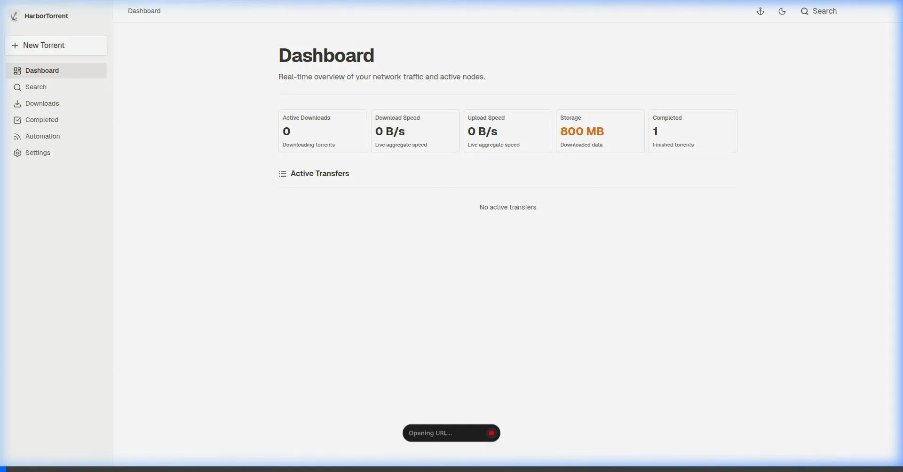
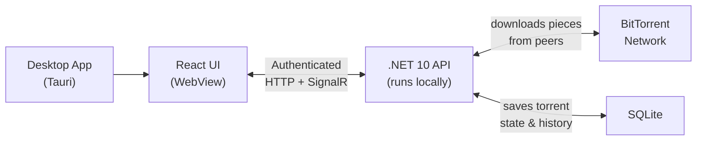

# HarborTorrent

A cross-platform desktop torrent management client for **Windows** and **Linux**, built with a modern React frontend and a self-hosted .NET 10 download engine.

HarborTorrent bundles the backend as a Tauri sidecar binary, so it ships as a single native desktop application — no separate server setup required.



---

## Features

- **Add torrents** via `.torrent` file (drag-and-drop supported), magnet link, or info hash
- **Real-time progress** — live download speed, upload speed, ETA, and peer count via SignalR WebSockets
- **Anchor Mode** — instantly throttle all bandwidth with a single toggle, useful while gaming or streaming
- **RSS Automation** — subscribe to RSS feeds and auto-download matching releases
- **Built-in search** — search Apibay and YTS directly from within the application
- **Video streaming** — stream partially downloaded video files directly in the app
- **Automatic updates** — checks GitHub Releases on startup and installs silently in the background
- **System tray integration** — minimize to tray so downloads continue running in the background
- **Desktop notifications** — OS-level notification when a download completes
- **Dark mode** — full light/dark theme support

---

## Tech Stack

| Layer | Technology |
|---|---|
| Desktop Shell | [Tauri v2](https://tauri.app) |
| UI Framework | React 18 + TypeScript + Vite |
| Styling | Vanilla CSS |
| Server State | TanStack Query v5 |
| Real-time Updates | Microsoft SignalR (WebSockets) |
| Download Engine | [MonoTorrent 3.x](https://github.com/alanmcgovern/monotorrent) |
| API | ASP.NET Core 10 Minimal APIs |
| ORM | Entity Framework Core 10 |
| Database | SQLite (embedded, zero setup) |
| Architecture | Clean Architecture + CQRS (MediatR) |

---

## Supported Platforms

| Operating System | Architecture | Package Formats |
|---|---|---|
| Windows 10/11 | x64 | `.msi`, `.exe` (NSIS) |
| Ubuntu 20.04+ / Debian | x64 | `.deb`, `.AppImage` |
| Fedora 38+ / RHEL | x64 | `.rpm`, `.AppImage` |


---

## Installation

Download the latest release from the [Releases page](https://github.com/Kampila45/HarborTorrent/releases).

### Windows

Run the `.msi` or `.exe` installer and follow the on-screen prompts. HarborTorrent will be added to the Start Menu.

### Linux — Debian / Ubuntu

```bash
sudo dpkg -i HarborTorrent_*.deb
```

### Linux — Fedora / RHEL

```bash
sudo dnf install ./HarborTorrent-*.rpm
# or
sudo rpm -i HarborTorrent-*.rpm
```

### Linux — AppImage (all distributions)

```bash
chmod +x HarborTorrent_*.AppImage
./HarborTorrent_*.AppImage
```

### Verifying downloads

SHA-256 checksums for all release assets are published in `checksums.sha256.txt` alongside each release.

```bash
sha256sum --check checksums.sha256.txt
```

---

## Repository Structure

```
HarborTorrent/
├── frontend/   # Tauri shell + React UI
└── backend/    # .NET 10 REST API (runs as Tauri sidecar)
```

- **[`frontend/`](./frontend/README.md)** — The Tauri + React application. Houses the UI, routing, real-time SignalR connection, and Tauri configuration. The compiled .NET binary is embedded here as a sidecar and launched automatically when the app starts.
- **[`backend/`](./backend/README.md)** — The ASP.NET Core solution. Implements the torrent lifecycle, file management, RSS automation, and exposes a typed REST API consumed by the frontend.

---

## How It Works


```mermaid
flowchart LR
    A["Desktop App\n(Tauri)"] --> B["React UI\n(WebView)"]
    B <-->|"Authenticated\nHTTP + SignalR"| C[".NET 10 API\n(runs locally)"]
    C <-->|"downloads pieces\nfrom peers"| D["BitTorrent\nNetwork"]
    C <-->|"saves torrent\nstate & history"| E["SQLite"]
```

1. Tauri generates a per-session **launch token** and selects a random free loopback port.
2. The `.NET` API sidecar is launched with the token and port injected via environment variables.
3. The React UI retrieves the token and port via the Tauri invoke bridge before making any API call.
4. All HTTP requests and SignalR connections are authenticated with the launch token.
5. **SignalR** pushes live torrent state (speed, progress, ETA) to the UI in real time.
6. When the application exits, Tauri kills the sidecar process — no orphaned processes remain.

---

## Local Development

### Prerequisites

- [Node.js 20+](https://nodejs.org)
- [.NET 10 SDK](https://dotnet.microsoft.com/download)
- [Rust toolchain](https://rustup.rs) (required by Tauri)
- No database setup needed — SQLite is embedded, and data is stored in the platform user data directory

### Running locally

```bash
# 1. Install frontend dependencies
cd frontend
npm install

# 2. Start the backend (in one terminal)
cd backend
dotnet run --project HarborTorrent.Api

# 3. Start the Tauri dev app (in another terminal)
cd frontend
npm run tauri dev
```

> In local development the backend runs on port 5000 and CORS allows all Vite dev-server origins.
> The launch token is not enforced when `HARBOR_LAUNCH_TOKEN` is absent from the environment.

### Linting and type-checking

```bash
cd frontend
npx tsc --noEmit
```

```bash
cd backend
dotnet build
```

---

## Building a Release

```bash
# 1. Publish the .NET sidecar (adjust --runtime as needed)
cd backend
dotnet publish HarborTorrent.Api \
  --runtime linux-x64 --self-contained true \
  -p:PublishSingleFile=true \
  -o ../frontend/src-tauri/binaries/

# 2. Rename the binary to match Tauri's sidecar naming convention
cd ../frontend
node scripts/rename-sidecar.mjs

# 3. Build the Tauri app
npm run tauri build
```

> For Windows, change `--runtime linux-x64` to `--runtime win-x64`.

The CI release workflow runs automatically when a version tag is pushed:

```bash
git tag v1.0.2
git push origin v1.0.2
```

---

## Data Storage

HarborTorrent stores all user data in the platform-standard application data directory:

| Platform | Path |
|---|---|
| Windows | `%APPDATA%\HarborTorrent\` |
| Linux | `~/.local/share/HarborTorrent/` |

Uninstalling the application does **not** delete this directory. Remove it manually to fully reset the application.

---

## Troubleshooting

**The application fails to start / shows a blank screen**
The `.NET` backend sidecar may not have started in time. Wait a few seconds and reopen the app. If the issue persists, check that no other HarborTorrent instance is already running.

**Magnet links do not start downloading**
Ensure DHT and PEX are enabled in Settings → Network & Engine. DHT is required for trackerless magnet link resolution.

**Linux — AppImage does not launch**
Make sure the file is executable: `chmod +x HarborTorrent_*.AppImage`.

**Linux — RPM dependency errors**
Install the WebKit dependency: `sudo dnf install webkit2gtk4.1`.

---

## API Reference

See [`backend/README.md`](./backend/README.md#api-reference) for the full REST API documentation.

---

## Contributing

See [CONTRIBUTING.md](./CONTRIBUTING.md) for development guidelines, coding principles, and pull request expectations.

## Security

See [SECURITY.md](./SECURITY.md) for the responsible disclosure policy.

## License

MIT
